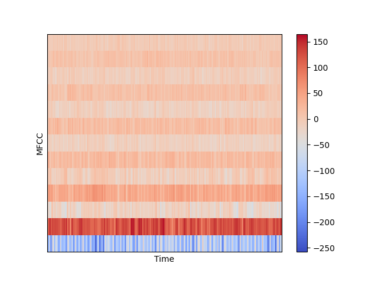

# -Deep-Learning-for-Audio-with-Python

## 01. Artificial Neuron Implementation
- **목표l:** 신경학습망의 기초 구성 이해.
- **Process:**
  1. Receive multiple inputs.
  2. Apply weights to each input.
  3. Calculate the weighted sum.
  4. Use Sigmoid activation function to squeeze the result between 0 and 1.
- 가중치 함: $h = \sum w_i x_i$
- Sigmoid: $y = \frac{1}{1 + e^{-h}}$
- **Tools:** Python `math` module.

## 02. Multilayer Perceptron Implementation
- **Goal:** 여러 은닉층을 가진 신경망 구조 설계 및 순전파 구현.
- **Process:**
  1. 입력층, 은닉층 리스트, 출력층을 포함한 전체 레이어 구조 정의.
  2. `numpy.random.randn`을 이용해 각 층 사이의 가중치 행렬 초기화.
  3. `numpy.dot` 행렬 곱셈을 통해 층간 데이터 흐름 구현.
  4. 반복문을 통해 각 층에 Sigmoid 활성화 함수 적용 및 최종 결과 도출.
- **Tools:** Python `NumPy`.

## 02.1 Structure Simulation

본 프로젝트의 동작 원리를 이해하기 위해 2(입력)-2(은닉)-1(출력) 레이어 구조를 기준으로 한 연산 과정을 정리합니다.

### 1. 전제 조건 (Notation)
* **Activations:** $a_0$ (입력층), $a_1$ (은닉층), $a_2$ (출력층)
* **Weights:** $W_0$ (입력-은닉 가중치), $W_1$ (은닉-출력 가중치)
* **Functions:** $\sigma$ (Sigmoid 활성화 함수), $\sigma'$ (Sigmoid 미분)
* **Target:** $y$ (실제 정답)

---

### 2. 순전파 (Forward Propagation)
데이터가 입력층에서 출력층으로 흐르며 예측값 $a_2$를 도출하는 과정입니다.

1.  **은닉층 계산:**
    $$h_1 = a_0 \cdot W_0$$
    $$a_1 = \sigma(h_1)$$
2.  **출력층 계산:**
    $$h_2 = a_1 \cdot W_1$$
    $$a_2 = \sigma(h_2)$$

---

### 3. 역전파 (Backpropagation)
오차를 바탕으로 뒤에서부터 각 층의 기여도(Delta)를 계산하고 가중치를 수정하는 과정입니다.

#### **Step 1: 출력층 (Output Layer)**
1.  **출력층 에러 ($error_2$):** 실제값과 예측값의 차이
    $$error_2 = y - a_2$$
2.  **출력층 델타 ($\delta_2$):** 에러에 출력층 기울기를 적용 (Hadamard product)
    $$\delta_2 = error_2 \odot \sigma'(a_2)$$
3.  **가중치 $W_1$ 수정안 ($Deriv_1$):**
    $$Deriv_1 = a_1^T \cdot \delta_2$$

#### **Step 2: 은닉층 (Hidden Layer)**
1.  **은닉층 에러 ($error_1$):** 출력층 델타가 가중치를 타고 역전파됨
    $$error_1 = \delta_2 \cdot W_1^T$$
2.  **은닉층 델타 ($\delta_1$):** 배달된 에러에 은닉층 기울기를 적용 (Hadamard product)
    $$\delta_1 = error_1 \odot \sigma'(a_1)$$
3.  **가중치 $W_0$ 수정안 ($Deriv_0$):**
    $$Deriv_0 = a_0^T \cdot \delta_1$$

---

### 4. 가중치 업데이트 (Weight Update)
계산된 미분값($Deriv$)과 학습률($\eta$)을 사용하여 가중치를 실제로 수정합니다.

* $W_1 = W_1 + \eta \cdot Deriv_1$
* $W_0 = W_0 + \eta \cdot Deriv_0$

---

### 💡 핵심 원리 요약
* **$\delta$ (Delta):** 각 층의 뉴런이 결과에 대해 책임져야 할 **오차의 본체**입니다. 항상 `error ⊙ f'(a)`의 일관된 형태로 계산됩니다.
* **$\cdot$ (Dot Product):** 에러 신호를 앞 층으로 **전달**하거나, 가중치 전체의 **수정 지도**를 그릴 때 사용합니다.
* **$\odot$ (Hadamard Product):** 해당 층의 활성화 함수 특성(기울기)을 에러에 **필터링**할 때 사용합니다.

### 🔢 수치 기반 시뮬레이션 (Numerical Example)

2-2-1 구조에서 실제 숫자가 어떻게 계산되고 전달되는지 단계별로 살펴봅니다.

#### **1. 순전파 (Forward)**
* **Input ($a_0$):** $[1.0, 2.0]$
* **Weights ($W_1$):** 모두 $0.5$로 가정 (은닉-출력 가중치)
* **Target ($y$):** $1.0$ (목표 정답)
* **Output ($a_2$):** $0.68$ (예측값), **Hidden ($a_1$):** $[0.6, 0.7]$

#### **2. 역전파 (Backward) - 출력층**
1.  **$error_2$ 계산:**
    $$error_2 = y - a_2 = 1.0 - 0.68 = \mathbf{0.32}$$
2.  **$\delta_2$ 계산 (오차 $\odot$ 기울기):**
    * $\sigma'(a_2) = 0.68 \times (1 - 0.68) \approx 0.22$
    $$\delta_2 = error_2 \odot \sigma'(a_2) = 0.32 \times 0.22 = \mathbf{0.07}$$
3.  **$Deriv_1$ 작성 (이전 층 출력 $a_1^T$와 델타 $\delta_2$의 내적):**
   
$$
\text{Deriv}_1 = \left[ \begin{matrix} 0.6 \\\\ 0.7 \end{matrix} \right] \cdot [0.07] = \left[ \begin{matrix} 0.042 \\\\ 0.049 \end{matrix} \right]
$$

#### **3. 역전파 (Backward) - 은닉층**
1.  **$error_1$ 전달 (에러 릴레이):**
    * $\delta_2$가 가중치 $W_1$을 타고 역행
    $$error_1 = \delta_2 \cdot W_1^T = [0.07] \cdot [0.5, 0.5] = \mathbf{[0.035, 0.035]}$$
2.  **$\delta_1$ 계산 (배달된 에러 $\odot$ 은닉층 기울기):**
    * $\sigma'(a_1) = [0.6(1-0.6), \; 0.7(1-0.7)] = [0.24, 0.21]$
    $$\delta_1 = error_1 \odot \sigma'(a_1) = [0.035, 0.035] \odot [0.24, 0.21] = \mathbf{[0.0084, 0.00735]}$$
3.  **$Deriv_0$ 작성 (입력값 $a_0^T$와 델타 $\delta_1$의 내적):**
   
$$
Deriv_0 = \begin{bmatrix} 1.0 \\\\ 2.0 \end{bmatrix} \cdot [0.0084, 0.00735]
$$

$$
Deriv_0 = \mathbf{\begin{bmatrix} 0.0084 & 0.00735 \\\\ 0.0168 & 0.0147 \end{bmatrix}}
$$

## 05. Training & Learning Implementation
- **Goal:** 데이터 세트를 반복 학습시켜 가중치를 실제로 수정함.
- **Process:**
  1. **데이터 공급:** `zip`을 이용해 `inputs`와 `targets`를 한 쌍의 세트로 묶어 꺼냄.
  2. **반복 학습:** `epochs` 횟수만큼 전체 데이터를 반복해서 수행함.
  3. **가중치 수정:** `gradient_descent`를 통해 계산된 미분값과 학습률을 연산하여 가중치를 업데이트함.

### 💡 학습 및 오차 분석 논리
- **데이터 추출 방식:** `zip`은 문제와 정답을 하나로 묶어주고, 루프를 돌며 각각의 세트를 꺼내 함수 인자로 사용함.
- **에러 누적 및 평균화:** - 각 루프마다 발생하는 `mse` 오차를 `sum_error`에 쌓음.
  - 한 epoch 루프가 끝날 때, 누적된 값을 **사용한 데이터 세트의 수(`len(inputs)`)**로 나눠야 데이터당 평균 오차를 확인할 수 있음.

## 06. Final Simulation Result & Test
- **Task:** 덧셈 연산 학습 ($x_1 + x_2$)
- **Dataset:** `random()/2`를 사용해 합이 1을 넘지 않는 1,000개의 데이터 생성.
- **Training:** 50 에포크 동안 총 50,000번의 학습 수행.

## 07. TensorFlow 활용 모델 구현 및 비교 (MLP_TF)

기존에 직접 파이썬으로 구현했던 신경망 로직을 **TensorFlow/Keras** 라이브러리를 사용하여 현대적인 방식으로 재구성하였습니다.

### 1️⃣ 모델 구성 및 비교 (2-5-1 MLP)
| 구분 | 밑바닥부터 짜기 (Raw Python) | TensorFlow Keras 사용 |
|:---:|:---|:---|
| **모델 정의** | `MLP` 클래스 생성, `Layer` 리스트 관리 | `tf.keras.Sequential`로 층을 차례로 쌓음 |
| **순전파** | `_sigmoid` 함수 및 행렬 곱 직접 구현 | `layers.Dense(activation="sigmoid")` 자동 처리 |
| **입력 설정** | 입력 벡터 크기에 맞춰 가중치 행렬 초기화 | `input_dim=2`를 통해 첫 번째 층의 입력 정의 |

### 2️⃣ 핵심 함수 및 파라미터 요약

* **Optimizer (최적화):** `tf.keras.optimizers.SGD(learning_rate=0.1)`
    * **의미:** 우리가 직접 미분($Gradient$)하여 가중치를 업데이트했던 과정을 자동화함.
    * **Learning Rate (0.1):** 가중치 업데이트 시의 **'보폭'**. 수동 구현 시 $W = W - \eta \cdot \nabla L$ 공식의 **$\eta$** 값과 동일함.
* **Loss Function (손실 함수):** `loss="MSE"`
    * 오류값의 정도를 계산하는 **평균 제곱 오차(Mean Squared Error)**법 활용.
* **Compile:** * 설계한 모델 구조와 최적화 방법(SGD), 손실 함수(MSE)를 하나로 묶어 컴퓨터가 계산 가능한 상태로 변환하는 선언 단계.

### 3️⃣ 학습 및 평가 프로세스 (Training & Evaluation)
* **Training (`model.fit`):**
    * **Epochs:** 전체 학습 데이터셋을 한 번 다 훑는 단위.
    * **Task:** 5,000개의 데이터를 7:3으로 분할하여 3,500개의 데이터를 100회 반복 학습 (총 350,000번의 연산 수행).
* **Evaluation (`model.evaluate`):**
    * 학습에 쓰이지 않은 1,500개의 테스트 데이터로 실제 성능 측정.
    * **Verbose=1:** 학습/평가 상황을 진행 막대기(Progress Bar)로 실시간 생중계하는 옵션.
* **Validation Logic:** Train Loss와 Test Loss의 차이가 크지 않아야 모델이 암기가 아닌 **'덧셈의 원리'**를 깨우쳤다고 판단함 (과적합 방지).

### 4️⃣ Final Simulation Result & Test
- **Task:** 덧셈 연산 학습 ($x_1 + x_2$)
- **Dataset:** `random()/2`를 사용해 합이 1을 넘지 않는 5,000개의 데이터 생성.
- **Training:** 100 에포크 동안 총 350,000번의 학습 수행.
- **Result:** 한 번도 보지 못한 `[[0.1, 0.2], [0.2, 0.2]]`와 같은 데이터를 주었을 때 정답에 근사한 값을 출력함.

## 08. Audio Data Preprocessing (STFT & MFCC)
- **Goal:** 시계열 데이터인 오디오를 AI 모델이 학습 가능한 '이미지' 형태의 특징량(Feature)으로 변환.
- **Process:**
  1. **Load:** 아날로그 신호를 디지털 샘플 배열(`signal`)로 변환.
  2. **STFT:** 시간의 흐름을 반영하기 위해 신호를 짧게 잘라 주파수 분석.
  3. **MFCC:** 인간의 청각 특성을 반영하여 소리의 '음색(Timbre)' 특징 추출.

---

### 08.1 Digital Audio Foundation (ADC & SR)
- **Concept:** 아날로그 신호를 초당 $sr$(Sampling Rate)만큼 샘플링하여 양자화(Quantize)하는 과정.
- **Nyquist Theorem:** 특정 주파수를 복원하려면 해당 주파수보다 최소 2배 이상의 속도로 샘플링해야 함. 인간의 가청 주파수(약 20kHz)를 고려하여 디지털 음원은 보통 44.1kHz를 사용하나, 딥러닝에서는 계산 효율을 위해 `sr=22050`을 주로 사용함.
- **Parameters:** `sr=22050` (1초에 22,050개의 점을 찍어 소리를 기록).

### 08.2 Waveform Analysis
- **Definition:** 시간축($x$)에 따른 진폭($y$, Amplitude)의 변화를 나타내는 Raw 데이터.
- **Characteristics:**
  - `signal`: 각 샘플의 진폭값(-1 ~ 1)을 담은 1차원 `NumPy` 배열.
  - **Data Size:** 30초 음원 기준 $22050 \times 30 = 661,500$ 개의 데이터 포인트로 구성.
- **Insight:** 전체적인 소리의 크기(Energy)와 타격감은 확인할 수 있으나, 어떤 주파수(음높이) 성분이 포함되어 있는지는 파악하기 어려움.

#### **📊 Waveform Result & Analysis**

### 08.3 Frequency Analysis (FFT & Spectrum)
- **Goal:** 시간 영역(Time Domain)의 파형을 주파수 영역(Frequency Domain)으로 변환하여 소리에 섞인 '음높이' 성분들을 분석.
- **Process:**
  1. **np.fft.fft(signal):** 이산 푸리에 변환을 수행하여 복소수 배열 생성.
  2. **Magnitude:** 복소수에 `np.abs()`를 취해 각 주파수 성분의 실제 에너지 세기를 도출.
  3. **Frequency Mapping:** `np.linspace(0, sr, len(magnitude))`를 통해 인덱스를 실제 주파수(Hz) 단위로 대응.
  4. **Nyquist Symmetry:** 실수 신호의 대칭성에 따라 의미 있는 양의 주파수 영역($0 \sim 11,025Hz$)만 추출.

#### **📊 FFT Result & Analysis**
- **Magnitude Peaks:** 그래프 좌측(0~2000Hz)에 거대한 에너지 피크들이 밀집해 있음. 이는 블루스 음악의 리듬과 무게감을 담당하는 베이스 기타, 드럼 킥의 저음역대 성분이 매우 강렬함을 시사함.
- **Frequency Distribution:** 4000Hz 이후로 갈수록 에너지가 급격히 감소함. 이는 음악의 주된 정보(악기 선율, 보컬)가 주로 저음과 중음역대에 집중되어 있음을 보여줌.
- **The "Missing Link" (FFT의 한계):** 주파수 성분의 비율은 명확히 알 수 있으나, 이 ' Magnitude'들이 **어느 시점(When)**에 튀어나왔는지는 알 수 없음. (30초 전체를 평균 낸 결과이기 때문)
- **Insight:** 이 시간 정보의 상실을 해결하기 위해, 신호를 아주 짧게 쪼개어 분석하는 **STFT(Spectrogram)** 과정이 필연적으로 뒤따라야 함.

### 08.4 Short-Time Fourier Transform (STFT & Spectrogram)
- **Goal:** FFT의 한계(시간 정보 소실)를 극복하기 위해 신호를 짧은 구간으로 나누어 '시간에 따른 주파수 변화'를 분석.
- **The Logic (지운님의 통찰):**
  - **데생의 음영:** 보폭(`hop_length`)을 윈도우 크기보다 작게 설정하여 겹치게 스캔함으로써, 연속적인 소리의 변화를 부드러운 음영처럼 그려냄.
  - **3차원 정보:** 가로축(시간), 세로축(주파수), 색상(에너지 세기)으로 소리를 시각화.

### 📊 Spectrogram Transformation: Linear vs. Log Scale

| 1. Linear Spectrogram (Before Log) | 2. Log Spectrogram (After Log/dB) |
| :---: | :---: |
|  |  |
| **물리적 진폭(Amplitude) 기반** | **데시벨(dB) 스케일 기반** |

#### **🔎 결과 비교 및 분석 (Analysis)**

1. **Linear Spectrogram (로그 취하기 전)**
   - **특징:** 소리의 물리적인 에너지가 아주 큰 부분(피크 지점)만 밝게 표시됨.
   - **한계:** 인간의 귀는 아주 작은 소리부터 큰 소리까지 광범위하게 인지하지만, 선형 그래프에서는 에너지가 조금만 낮아도 모두 검은색으로 묻혀버려 세밀한 음색 패턴이나 배음 구조를 파악하기 어려움.

2. **Log Spectrogram (로그 취한 후/dB 변환)**
   - **특징:** `librosa.amplitude_to_db`를 통해 작은 에너지 변화도 시각적으로 드러나게 변환.
   - **장점:** - **인간의 인지 반영:** 인간은 소리의 크기를 로그(Log) 단위로 인지하므로, 실제 우리가 귀로 듣는 느낌과 시각적 정보가 일치하게 됨.
     - **디테일 부각:** 이전에는 보이지 않던 저음역대의 미세한 움직임과 고음역대의 배음(Harmonics) 구조가 명확하게 드러남.
     - **학습 효율:** 데이터의 범위가 압축되어 딥러닝 모델이 소리의 특징을 더 안정적으로 학습할 수 있는 상태가 됨.

### 08.5 Mel-Frequency Cepstral Coefficients (MFCCs)
- **Goal:** 주파수 전체가 아닌, 소리의 '음색(Timbre)'을 결정짓는 핵심 지문 13개를 추출.
- **Concept:** - **Mel Scale:** 인간의 귀가 저음역대 변화에 더 민감하다는 특성을 반영하여 주파수 축을 재조정.
  - **Feature Compression:** Spectrogram의 방대한 정보를 13개의 추상화된 계수로 압축하여 딥러닝 모델이 '공부하기 좋은 요약본'을 제공.

#### **📊 MFCC Result & Analysis**
- **Feature Extraction:** 약 66만 개의 샘플 데이터를 단 13개의 특징 열로 압축함에도 불구하고, 음원의 고유한 정체성은 유지됨.
- **Interpretation:** - 맨 아래쪽 붉은색 띠(0번 계수)는 음원의 **전체적인 에너지 흐름**을 나타냄.
  - 상단의 1~12번 계수들은 **소리의 질감 패턴**을 담고 있으며, 가로로 이어지는 색상의 변화가 곧 이 블루스 음악의 '음색적 지문'임.
- **Final Insight:** AI 모델은 이제 이 13가지 성분의 시계열 변화를 학습하여, 새로운 소리가 들렸을 때 그것이 '블루스'인지 '재즈'인지 판별할 수 있는 능력을 갖추게 됨.
