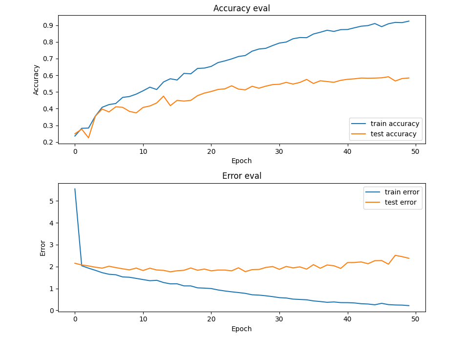
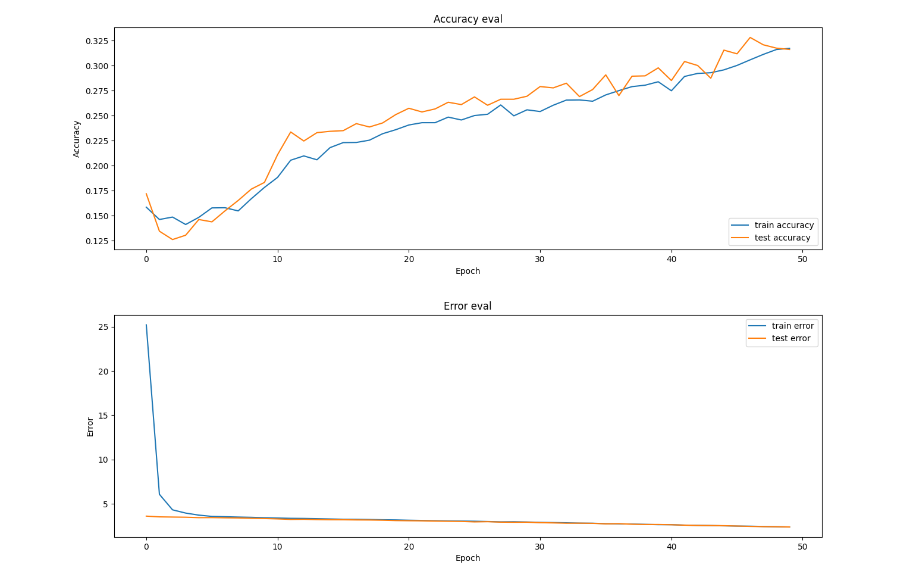

# -Deep-Learning-for-Audio-with-Python

## 01. Artificial Neuron Implementation
- **목표l:** 신경학습망의 기초 구성 이해.
- **Process:**
  1. Receive multiple inputs.
  2. Apply weights to each input.
  3. Calculate the weighted sum.
  4. Use Sigmoid activation function to squeeze the result between 0 and 1.
- 가중치 함: $h = \sum w_i x_i$
- Sigmoid: $y = \frac{1}{1 + e^{-h}}$
- **Tools:** Python `math` module.

## 02. Multilayer Perceptron Implementation
- **Goal:** 여러 은닉층을 가진 신경망 구조 설계 및 순전파 구현.
- **Process:**
  1. 입력층, 은닉층 리스트, 출력층을 포함한 전체 레이어 구조 정의.
  2. `numpy.random.randn`을 이용해 각 층 사이의 가중치 행렬 초기화.
  3. `numpy.dot` 행렬 곱셈을 통해 층간 데이터 흐름 구현.
  4. 반복문을 통해 각 층에 Sigmoid 활성화 함수 적용 및 최종 결과 도출.
- **Tools:** Python `NumPy`.

## 02.1 Structure Simulation

본 프로젝트의 동작 원리를 이해하기 위해 2(입력)-2(은닉)-1(출력) 레이어 구조를 기준으로 한 연산 과정을 정리합니다.

### 1. 전제 조건 (Notation)
* **Activations:** $a_0$ (입력층), $a_1$ (은닉층), $a_2$ (출력층)
* **Weights:** $W_0$ (입력-은닉 가중치), $W_1$ (은닉-출력 가중치)
* **Functions:** $\sigma$ (Sigmoid 활성화 함수), $\sigma'$ (Sigmoid 미분)
* **Target:** $y$ (실제 정답)

---

### 2. 순전파 (Forward Propagation)
데이터가 입력층에서 출력층으로 흐르며 예측값 $a_2$를 도출하는 과정입니다.

1.  **은닉층 계산:**
    $$h_1 = a_0 \cdot W_0$$
    $$a_1 = \sigma(h_1)$$
2.  **출력층 계산:**
    $$h_2 = a_1 \cdot W_1$$
    $$a_2 = \sigma(h_2)$$


---

### 3. 역전파 (Backpropagation)
오차를 바탕으로 뒤에서부터 각 층의 기여도(Delta)를 계산하고 가중치를 수정하는 과정입니다.

#### **Step 1: 출력층 (Output Layer)**
1.  **출력층 에러 ($error_2$):** 실제값과 예측값의 차이
    $$error_2 = y - a_2$$
2.  **출력층 델타 ($\delta_2$):** 에러에 출력층 기울기를 적용 (Hadamard product)
    $$\delta_2 = error_2 \odot \sigma'(a_2)$$
3.  **가중치 $W_1$ 수정안 ($Deriv_1$):**
    $$Deriv_1 = a_1^T \cdot \delta_2$$

#### **Step 2: 은닉층 (Hidden Layer)**
1.  **은닉층 에러 ($error_1$):** 출력층 델타가 가중치를 타고 역전파됨
    $$error_1 = \delta_2 \cdot W_1^T$$
2.  **은닉층 델타 ($\delta_1$):** 배달된 에러에 은닉층 기울기를 적용 (Hadamard product)
    $$\delta_1 = error_1 \odot \sigma'(a_1)$$
3.  **가중치 $W_0$ 수정안 ($Deriv_0$):**
    $$Deriv_0 = a_0^T \cdot \delta_1$$


---

### 4. 가중치 업데이트 (Weight Update)
계산된 미분값($Deriv$)과 학습률($\eta$)을 사용하여 가중치를 실제로 수정합니다.

* $W_1 = W_1 + \eta \cdot Deriv_1$
* $W_0 = W_0 + \eta \cdot Deriv_0$

---

### 💡 핵심 원리 요약
* **$\delta$ (Delta):** 각 층의 뉴런이 결과에 대해 책임져야 할 **오차의 본체**입니다. 항상 `error ⊙ f'(a)`의 일관된 형태로 계산됩니다.
* **$\cdot$ (Dot Product):** 에러 신호를 앞 층으로 **전달**하거나, 가중치 전체의 **수정 지도**를 그릴 때 사용합니다.
* **$\odot$ (Hadamard Product):** 해당 층의 활성화 함수 특성(기울기)을 에러에 **필터링**할 때 사용합니다.

### 🔢 수치 기반 시뮬레이션 (Numerical Example)

2-2-1 구조에서 실제 숫자가 어떻게 계산되고 전달되는지 단계별로 살펴봅니다.

#### **1. 순전파 (Forward)**
* **Input ($a_0$):** $[1.0, 2.0]$
* **Weights ($W_1$):** 모두 $0.5$로 가정 (은닉-출력 가중치)
* **Target ($y$):** $1.0$ (목표 정답)
* **Output ($a_2$):** $0.68$ (예측값), **Hidden ($a_1$):** $[0.6, 0.7]$

#### **2. 역전파 (Backward) - 출력층**
1.  **$error_2$ 계산:**
    $$error_2 = y - a_2 = 1.0 - 0.68 = \mathbf{0.32}$$
2.  **$\delta_2$ 계산 (오차 $\odot$ 기울기):**
    * $\sigma'(a_2) = 0.68 \times (1 - 0.68) \approx 0.22$
    $$\delta_2 = error_2 \odot \sigma'(a_2) = 0.32 \times 0.22 = \mathbf{0.07}$$
3.  **$Deriv_1$ 작성 (이전 층 출력 $a_1^T$와 델타 $\delta_2$의 내적):**
   
$$
\text{Deriv}_1 = \left[ \begin{matrix} 0.6 \\\\ 0.7 \end{matrix} \right] \cdot [0.07] = \left[ \begin{matrix} 0.042 \\\\ 0.049 \end{matrix} \right]
$$

#### **3. 역전파 (Backward) - 은닉층**
1.  **$error_1$ 전달 (에러 릴레이):**
    * $\delta_2$가 가중치 $W_1$을 타고 역행
    $$error_1 = \delta_2 \cdot W_1^T = [0.07] \cdot [0.5, 0.5] = \mathbf{[0.035, 0.035]}$$
2.  **$\delta_1$ 계산 (배달된 에러 $\odot$ 은닉층 기울기):**
    * $\sigma'(a_1) = [0.6(1-0.6), \; 0.7(1-0.7)] = [0.24, 0.21]$
    $$\delta_1 = error_1 \odot \sigma'(a_1) = [0.035, 0.035] \odot [0.24, 0.21] = \mathbf{[0.0084, 0.00735]}$$
3.  **$Deriv_0$ 작성 (입력값 $a_0^T$와 델타 $\delta_1$의 내적):**
   
$$
Deriv_0 = \begin{bmatrix} 1.0 \\\\ 2.0 \end{bmatrix} \cdot [0.0084, 0.00735]
$$

$$
Deriv_0 = \mathbf{\begin{bmatrix} 0.0084 & 0.00735 \\\\ 0.0168 & 0.0147 \end{bmatrix}}
$$

## 05. Training & Learning Implementation
- **Goal:** 데이터 세트를 반복 학습시켜 가중치를 실제로 수정함.
- **Process:**
  1. **데이터 공급:** `zip`을 이용해 `inputs`와 `targets`를 한 쌍의 세트로 묶어 꺼냄.
  2. **반복 학습:** `epochs` 횟수만큼 전체 데이터를 반복해서 수행함.
  3. **가중치 수정:** `gradient_descent`를 통해 계산된 미분값과 학습률을 연산하여 가중치를 업데이트함.

### 💡 학습 및 오차 분석 논리
- **데이터 추출 방식:** `zip`은 문제와 정답을 하나로 묶어주고, 루프를 돌며 각각의 세트를 꺼내 함수 인자로 사용함.
- **에러 누적 및 평균화:** - 각 루프마다 발생하는 `mse` 오차를 `sum_error`에 쌓음.
  - 한 epoch 루프가 끝날 때, 누적된 값을 **사용한 데이터 세트의 수(`len(inputs)`)**로 나눠야 데이터당 평균 오차를 확인할 수 있음.

## 06. Final Simulation Result & Test
- **Task:** 덧셈 연산 학습 ($x_1 + x_2$)
- **Dataset:** `random()/2`를 사용해 합이 1을 넘지 않는 1,000개의 데이터 생성.
- **Training:** 50 에포크 동안 총 50,000번의 학습 수행.

## 07. TensorFlow 활용 모델 구현 및 비교 (MLP_TF)

기존에 직접 파이썬으로 구현했던 신경망 로직을 **TensorFlow/Keras** 라이브러리를 사용하여 현대적인 방식으로 재구성하였습니다.

### 1️⃣ 모델 구성 및 비교 (2-5-1 MLP)
| 구분 | 밑바닥부터 짜기 (Raw Python) | TensorFlow Keras 사용 |
|:---:|:---|:---|
| **모델 정의** | `MLP` 클래스 생성, `Layer` 리스트 관리 | `tf.keras.Sequential`로 층을 차례로 쌓음 |
| **순전파** | `_sigmoid` 함수 및 행렬 곱 직접 구현 | `layers.Dense(activation="sigmoid")` 자동 처리 |
| **입력 설정** | 입력 벡터 크기에 맞춰 가중치 행렬 초기화 | `input_dim=2`를 통해 첫 번째 층의 입력 정의 |

### 2️⃣ 핵심 함수 및 파라미터 요약

* **Optimizer (최적화):** `tf.keras.optimizers.SGD(learning_rate=0.1)`
    * **의미:** 우리가 직접 미분($Gradient$)하여 가중치를 업데이트했던 과정을 자동화함.
    * **Learning Rate (0.1):** 가중치 업데이트 시의 **'보폭'**. 수동 구현 시 $W = W - \eta \cdot \nabla L$ 공식의 **$\eta$** 값과 동일함.
* **Loss Function (손실 함수):** `loss="MSE"`
    * 오류값의 정도를 계산하는 **평균 제곱 오차(Mean Squared Error)**법 활용.
* **Compile:** * 설계한 모델 구조와 최적화 방법(SGD), 손실 함수(MSE)를 하나로 묶어 컴퓨터가 계산 가능한 상태로 변환하는 선언 단계.

### 3️⃣ 학습 및 평가 프로세스 (Training & Evaluation)
* **Training (`model.fit`):**
    * **Epochs:** 전체 학습 데이터셋을 한 번 다 훑는 단위.
    * **Task:** 5,000개의 데이터를 7:3으로 분할하여 3,500개의 데이터를 100회 반복 학습 (총 350,000번의 연산 수행).
* **Evaluation (`model.evaluate`):**
    * 학습에 쓰이지 않은 1,500개의 테스트 데이터로 실제 성능 측정.
    * **Verbose=1:** 학습/평가 상황을 진행 막대기(Progress Bar)로 실시간 생중계하는 옵션.
* **Validation Logic:** Train Loss와 Test Loss의 차이가 크지 않아야 모델이 암기가 아닌 **'덧셈의 원리'**를 깨우쳤다고 판단함 (과적합 방지).

### 4️⃣ Final Simulation Result & Test
- **Task:** 덧셈 연산 학습 ($x_1 + x_2$)
- **Dataset:** `random()/2`를 사용해 합이 1을 넘지 않는 5,000개의 데이터 생성.
- **Training:** 100 에포크 동안 총 350,000번의 학습 수행.
- **Result:** 한 번도 보지 못한 `[[0.1, 0.2], [0.2, 0.2]]`와 같은 데이터를 주었을 때 정답에 근사한 값을 출력함.

## 08. Audio Data Preprocessing (STFT & MFCC)
- **Goal:** 시계열 데이터인 오디오를 AI 모델이 학습 가능한 '이미지' 형태의 특징량(Feature)으로 변환.
- **Process:**
  1. **Load:** 아날로그 신호를 디지털 샘플 배열(`signal`)로 변환.
  2. **STFT:** 시간의 흐름을 반영하기 위해 신호를 짧게 잘라 주파수 분석.
  3. **MFCC:** 인간의 청각 특성을 반영하여 소리의 '음색(Timbre)' 특징 추출.

---

### 08.1 Digital Audio Foundation (ADC & SR)
- **Concept:** 아날로그 신호를 초당 $sr$(Sampling Rate)만큼 샘플링하여 양자화(Quantize)하는 과정.
- **Nyquist Theorem:** 특정 주파수를 복원하려면 해당 주파수보다 최소 2배 이상의 속도로 샘플링해야 함. 인간의 가청 주파수(약 20kHz)를 고려하여 디지털 음원은 보통 44.1kHz를 사용하나, 딥러닝에서는 계산 효율을 위해 `sr=22050`을 주로 사용함.
- **Parameters:** `sr=22050` (1초에 22,050개의 점을 찍어 소리를 기록).

### 08.2 Waveform Analysis
- **Definition:** 시간축($x$)에 따른 진폭($y$, Amplitude)의 변화를 나타내는 Raw 데이터.
- **Characteristics:**
  - `signal`: 각 샘플의 진폭값(-1 ~ 1)을 담은 1차원 `NumPy` 배열.
  - **Data Size:** 30초 음원 기준 $22050 \times 30 = 661,500$ 개의 데이터 포인트로 구성.
- **Insight:** 전체적인 소리의 크기(Energy)와 타격감은 확인할 수 있으나, 어떤 주파수(음높이) 성분이 포함되어 있는지는 파악하기 어려움.

#### **📊 Waveform Result & Analysis**


### 08.3 Frequency Analysis (FFT & Spectrum)
- **Goal:** 시간 영역(Time Domain)의 파형을 주파수 영역(Frequency Domain)으로 변환하여 소리에 섞인 '음높이' 성분들을 분석.
- **Process:**
  1. **np.fft.fft(signal):** 이산 푸리에 변환을 수행하여 복소수 배열 생성.
  2. **Magnitude:** 복소수에 `np.abs()`를 취해 각 주파수 성분의 실제 에너지 세기를 도출.
  3. **Frequency Mapping:** `np.linspace(0, sr, len(magnitude))`를 통해 인덱스를 실제 주파수(Hz) 단위로 대응.
  4. **Nyquist Symmetry:** 실수 신호의 대칭성에 따라 의미 있는 양의 주파수 영역($0 \sim 11,025Hz$)만 추출.


#### **📊 FFT Result & Analysis**
- **Magnitude Peaks:** 그래프 좌측(0~2000Hz)에 거대한 에너지 피크들이 밀집해 있음. 이는 블루스 음악의 리듬과 무게감을 담당하는 베이스 기타, 드럼 킥의 저음역대 성분이 매우 강렬함을 시사함.
- **Frequency Distribution:** 4000Hz 이후로 갈수록 에너지가 급격히 감소함. 이는 음악의 주된 정보(악기 선율, 보컬)가 주로 저음과 중음역대에 집중되어 있음을 보여줌.
- **The "Missing Link" (FFT의 한계):** 주파수 성분의 비율은 명확히 알 수 있으나, 이 ' Magnitude'들이 **어느 시점(When)**에 튀어나왔는지는 알 수 없음. (30초 전체를 평균 낸 결과이기 때문)
- **Insight:** 이 시간 정보의 상실을 해결하기 위해, 신호를 아주 짧게 쪼개어 분석하는 **STFT(Spectrogram)** 과정이 필연적으로 뒤따라야 함.


### 08.4 Short-Time Fourier Transform (STFT & Spectrogram)
- **Goal:** FFT의 한계(시간 정보 소실)를 극복하기 위해 신호를 짧은 구간으로 나누어 '시간에 따른 주파수 변화'를 분석.
- **The Logic (지운님의 통찰):**
  - **데생의 음영:** 보폭(`hop_length`)을 윈도우 크기보다 작게 설정하여 겹치게 스캔함으로써, 연속적인 소리의 변화를 부드러운 음영처럼 그려냄.
  - **3차원 정보:** 가로축(시간), 세로축(주파수), 색상(에너지 세기)으로 소리를 시각화.

### 📊 Spectrogram Transformation: Linear vs. Log Scale

| 1. Linear Spectrogram (Before Log) | 2. Log Spectrogram (After Log/dB) |
| :---: | :---: |
|  |  |
| **물리적 진폭(Amplitude) 기반** | **데시벨(dB) 스케일 기반** |

#### **🔎 결과 비교 및 분석 (Analysis)**

1. **Linear Spectrogram (로그 취하기 전)**
   - **특징:** 소리의 물리적인 에너지가 아주 큰 부분(피크 지점)만 밝게 표시됨.
   - **한계:** 인간의 귀는 아주 작은 소리부터 큰 소리까지 광범위하게 인지하지만, 선형 그래프에서는 에너지가 조금만 낮아도 모두 검은색으로 묻혀버려 세밀한 음색 패턴이나 배음 구조를 파악하기 어려움.

2. **Log Spectrogram (로그 취한 후/dB 변환)**
   - **특징:** `librosa.amplitude_to_db`를 통해 작은 에너지 변화도 시각적으로 드러나게 변환.
   - **장점:** - **인간의 인지 반영:** 인간은 소리의 크기를 로그(Log) 단위로 인지하므로, 실제 우리가 귀로 듣는 느낌과 시각적 정보가 일치하게 됨.
     - **디테일 부각:** 이전에는 보이지 않던 저음역대의 미세한 움직임과 고음역대의 배음(Harmonics) 구조가 명확하게 드러남.
     - **학습 효율:** 데이터의 범위가 압축되어 딥러닝 모델이 소리의 특징을 더 안정적으로 학습할 수 있는 상태가 됨.

### 08.5 Mel-Frequency Cepstral Coefficients (MFCCs)
- **Goal:** 주파수 전체가 아닌, 소리의 '음색(Timbre)'을 결정짓는 핵심 지문 13개를 추출.
- **Concept:** - **Mel Scale:** 인간의 귀가 저음역대 변화에 더 민감하다는 특성을 반영하여 주파수 축을 재조정.
  - **Feature Compression:** Spectrogram의 방대한 정보를 13개의 추상화된 계수로 압축하여 딥러닝 모델이 '공부하기 좋은 요약본'을 제공.


#### **📊 MFCC Result & Analysis**
- **Feature Extraction:** 약 66만 개의 샘플 데이터를 단 13개의 특징 열로 압축함에도 불구하고, 음원의 고유한 정체성은 유지됨.
- **Interpretation:** - 맨 아래쪽 붉은색 띠(0번 계수)는 음원의 **전체적인 에너지 흐름**을 나타냄.
  - 상단의 1~12번 계수들은 **소리의 질감 패턴**을 담고 있으며, 가로로 이어지는 색상의 변화가 곧 이 블루스 음악의 '음색적 지문'임.
- **Final Insight:** AI 모델은 이제 이 13가지 성분의 시계열 변화를 학습하여, 새로운 소리가 들렸을 때 그것이 '블루스'인지 '재즈'인지 판별할 수 있는 능력을 갖추게 됨.

## 09. Audio Data Preprocessing (STFT & MFCC) Pipeline

### 09.1 데이터 저장 방식의 전략 (왜 JSON인가?)

#### 1) Raw Data 대비 획기적인 용량 다이어트
* **기존 문제**: `.wav` 파일은 `Sample Rate(22050) × 시간(30초)` 만큼의 데이터를 가짐. 1곡당 약 66만 개의 샘플을 실시간 연산하기엔 하드웨어 부담이 너무 큼.
* **해결책**: 오디오 파형(Waveform) 전체를 들고 가는 게 아니라, 학습에 필요한 **음색 지문(MFCC)**만 추출해 저장함. 
* **결과**: 수천 개의 고용량 음원을 직접 로드할 필요 없이, 이미 계산이 끝난 숫자 리스트(JSON)만 읽어오면 되므로 데이터 로딩 속도가 비약적으로 상승함.

#### 2) JSON 형식을 통한 데이터 구조의 유연성(가변성)
* **커스텀 설계**: JSON은 고정된 형식이 아님. 우리가 설계한 `mapping`, `mfcc`, `labels`라는 구조 안에 필요한 정보를 선택적으로 담을 수 있음.
* **공유 및 가독성**: 바이너리 형태의 데이터보다 사람이 구조를 파악하기 쉽고, Python의 Dictionary와 1:1 대응되어 모델 학습 시 데이터를 공급하는 파이프라인 구축이 매우 용이함.

#### 3) MFCC 13개: 소리의 '핵심 요약본' 전략
* **데이터 압축**: 주파수 전체 성분을 다 저장하면 정보량이 여전히 방대함. 하지만 인간의 청각 특성을 반영한 **MFCC 13개**만으로도 해당 장르의 음색적 특징을 충분히 표현 가능함.
* **학습 정확도 향상**: 불필요한 고주파 노이즈나 세세한 정보를 버리고, 장르 분류에 핵심적인 **'음색의 패턴'**만 남김으로써 모델이 데이터에 포함된 노이즈 대신 본질적인 특징에 집중하게 만듦.

#### 4) FFT 기반 주파수 저장 방식과의 비교
* **FFT 방식**: 단순히 모든 주파수 성분을 저장하면 시점마다 수천 개의 데이터 포인트가 발생하여 JSON 구조가 지나치게 방대해지고 복잡해짐.
* **MFCC 방식**: FFT 결과에 Mel-filter bank와 로그 연산 등을 추가하여 정보를 13개의 계수로 압축함. 결과적으로 **컴퓨터의 연산 부담은 최소화**하면서도 **학습 효율은 극대화**하는 최적의 밸런스를 찾은 결과임.

### 09.2 Dictionary 구조와 데이터 매칭 원리 (Data Simulation)

#### 1) 딕셔너리의 구성 요소와 역할
추출된 데이터는 `mapping`, `mfcc`, `labels`라는 세 가지 핵심 열쇠(Key)로 관리되며, 이는 모델이 학습할 '교과서'의 목차, 본문, 정답지와 같음.

* **`mapping` (장르 이름표)**: 숫자로 바뀐 장르 번호가 실제 어떤 장르(예: "hiphop", "blues")인지 알려주는 번역기임. 리스트의 인덱스 번호가 곧 장르의 ID가 됨.
* **`mfcc` (데이터 본체)**: 모델이 패턴을 읽어내야 할 실제 숫자 지도임. 3차원 배열 구조로 이루어져 있으며, 학습에 필요한 모든 소리의 지문이 담김.
* **`labels` (정답 번호)**: 각 MFCC 덩어리가 어떤 장르인지 알려주는 정답지임. `mapping` 리스트의 인덱스 번호를 저장하여 문제(MFCC)와 정답(Label)을 1:1로 매칭함.

#### 2) `mfcc` 3차원 배열의 정밀 구조 (5 × 258 × 13)
데이터가 저장되는 깊이를 시뮬레이션하면 다음과 같은 체계적인 구조를 가짐.

* **1단계 (총 5개의 꾸러미)**: 30초 노래를 5등분 했으므로, 한 곡당 6초짜리 MFCC 덩어리가 5개 생성됨.
* **2단계 (약 258개의 시간 줄)**: 6초의 조각을 `hop_length(512)` 단위로 쪼개어 분석한 결과물임. (약 6초 × 22050Hz / 512 ≈ 258줄)
* **3단계 (13개의 실수 값)**: 각 시간 줄마다 추출된 소리의 핵심 특징(MFCC 계수)들임. 이 13개의 숫자가 모여 해당 시점의 '음색'을 결정함.

#### 3) 데이터 저장 상태 시뮬레이션 (hiphop.00004.wav 처리 예시)
실제 데이터가 딕셔너리에 누적되는 과정을 시각화하면 다음과 같음.

```python
data = {
    # 1. mapping: 인덱스 번호와 장르명을 매칭 (2번 인덱스 = "hiphop")
    "mapping": ["classical", "blues", "hiphop"],

    # 2. mfcc: 1곡(30초)을 5등분(6초씩)하여 추출된 숫자 지도들
    # 각 조각은 [258(시간) x 13(음색)]의 행렬 구조를 가짐
    "mfcc": [
        [[...], [...], ...], # 1번째 6초 구간 (MFCC 행렬)
        [[...], [...], ...], # 2번째 6초 구간 (MFCC 행렬)
        [[...], [...], ...], # 3번째 6초 구간 (MFCC 행렬)
        [[...], [...], ...], # 4번째 6초 구간 (MFCC 행렬)
        [[...], [...], ...]  # 5번째 6초 구간 (MFCC 행렬)
    ],

    # 3. labels: 위 5개 덩어리가 모두 'hiphop(2번)'임을 증명하는 정답 번호
    "labels": [2, 2, 2, 2, 2] 
}
```
### 09.3 전처리 공정의 자동화와 규격화 로직 (Algorithm & Safety)

#### 1) 3중 반복문과 '우체부' 메커니즘 (`os.walk`)
`os.walk` 함수를 사용하여 데이터셋 폴더의 가장 깊은 곳까지 파고들며 데이터를 수집함.
* **폴더 탐색 전략**: `Data/genres/`를 시작점으로 잡으면 하위 폴더(blues, hiphop 등)를 하나씩 방문함. 
* **주의사항**: 하위 폴더 구조가 중첩되면(예: `music/jazz/`) 시스템이 'music' 자체를 장르로 오해할 수 있으므로, 데이터셋은 항상 `장르명/파일들`의 단일 계층 구조를 유지해야 함.
* **filenames의 의미**: 우체부가 특정 장르 폴더에 도착했을 때, 그 안에 들어있는 개별 음원 파일들의 목록을 의미함.

#### 2) 세그먼트당 샘플 계산 (`num_samples_per_segment`)
* **개념**: 트랙당 총 샘플 수(`SAMPLE_PER_TRACK`)를 `num_segments(5)`로 나눈 값임.
* **수치**: 30초 음원 기준, 6초의 세그먼트당 약 132,300개의 샘플 데이터가 존재함을 정의함.

#### 3) 데이터 규격화를 위한 안전장치 (`expected_num_mfcc_vectors`)
딥러닝 모델은 입력 데이터의 크기가 모두 **칼같이 동일**해야 함. 이를 위해 두 가지 장치를 둠.

* **가로줄 개수의 고정 (올림 처리)**: 6초 조각을 분석할 때 `math.ceil`을 사용하여 약 258개의 가로줄(MFCC 벡터)이 생기도록 강제함. 음원이 아주 미세하게 짧더라도 동일한 크기의 행렬을 만들기 위함임.
* **상한선 제어 (`finish_sample`)**: 분석 범위가 258개를 넘어가지 않도록 끝 지점을 미리 계산해서 잘라놓음. 덕분에 모든 세그먼트는 **[258 × 13]**이라는 완벽한 규격의 행렬로 탄생함.

#### 4) 불량 조각 검수 로직
모든 계산을 마친 후, 최종 추출된 MFCC의 길이가 `expected_num_mfcc_vectors`와 일치하는지 한 번 더 확인(`if len(mfcc) == ...`)함. 
* **이유**: 0.1초라도 모자란 '규격 미달' 조각이 학습 데이터에 섞여 들어가는 순간, 전체 모델 학습이 에러로 멈추는 것을 방지하기 위함임.

### 09.4 데이터셋 구축의 핵심 알고리즘 (3중 Loop & Data Mapping)

#### 1) 3중 반복문 구조의 설계 의도
전체 공정은 **장르 -> 파일 -> 세그먼트** 순으로 파고드는 체계적인 계층 구조로 작동함.

* **1단계: `os.walk` (장르 탐색)**: `dataset_path`부터 하위 폴더까지 파고듦. `i=0`은 최상위 폴더이므로 제외하고, 세부 장르(blues, hiphop 등)가 시작되는 시점부터 `i-1`을 인덱스로 활용해 장르별 숫자 ID를 부여함.
* **2단계: `filenames` (파일 호출)**: 각 장르 폴더 내의 음원 파일을 하나씩 로드함. `os.path.join`을 통해 윈도우/리눅스 환경에 구애받지 않는 표준 경로를 생성하여 파일을 불러옴.
* **3단계: `num_segments` (데이터 뻥튀기)**: 30초 음원을 10개(설정에 따라 다름)의 조각으로 나눔. `start`와 `finish` 샘플 위치를 계산해 하나의 음원에서 여러 개의 학습용 MFCC를 추출, 데이터 양을 획기적으로 늘림.


#### 2) MFCC 추출 및 규격 검수 (Safety Guard)
* **Transpose (`.T`)**: `librosa`에서 추출된 기본 MFCC는 [13 × 258] 구조임. 하지만 딥러닝 모델에 입력하기 위해선 시간 축을 기준으로 한 [258 × 13] 구조가 필요하므로 행렬을 뒤집어줌.
* **엄격한 규격 확인**: `math.ceil`로 계산된 `expected_num_mfcc_vectors`와 실제 추출된 길이를 비교함. 단 하나의 샘플이라도 모자란 조각은 `data["mfcc"]`에 담지 않고 과감히 버림으로써 데이터셋의 무결성을 유지함.

#### 3) JSON 데이터 바인딩 시뮬레이션
최종적으로 `data` 딕셔너리에 저장되는 논리는 다음과 같음.

* **문제지 (`mfcc`)**: 258개의 가로줄(시간)과 13개의 세로줄(음색 특징)을 가진 리스트가 차곡차곡 쌓임. (Numpy 배열은 저장이 안 되므로 `.tolist()`로 변환)
* **정답지 (`labels`)**: 만약 2번 폴더가 힙합이라면, 그 안의 모든 파일에서 나온 모든 세그먼트에 대해 `labels.append(2)`를 수행함. 
* **연결 고리**: `mapping[2]`는 "hiphop", `labels`의 값은 `2`. 모델은 이를 통해 "아, 이 258×13 행렬 패턴은 힙합이구나!"라고 학습하게 됨.

#### 4) 최종 저장 및 결과 (`json.dump`)
* 모든 루프가 종료되면 쌓인 `data` 딕셔너리를 `json_path`에 파일로 기록함.
* `indent=4` 옵션을 주어 사람도 눈으로 구조를 쉽게 파악할 수 있도록 들여쓰기 된 깔끔한 JSON 파일을 생성함.


## 10. Multi-Layer Perceptron (MLP) for Genre Classification

기존의 덧셈 연산(MLP_TF)을 넘어, 전처리된 오디오 특징량(MFCC)을 기반으로 10가지 음악 장르를 분류하는 심층 신경망 모델을 구현하고 학습 프로세스를 최적화하였습니다.

### 10.1 모델 아키텍처 명세 (Model Summary)

TensorFlow의 `model.summary()` 함수를 통해 확인한 모델의 계층 구조와 파라미터 배정 현황입니다. 약 100만 개의 학습 가능한 파라미터가 각 층에 배분되어 있음.

```text
Model: "sequential"
┏━━━━━━━━━━━━━━━━━━━━━━━━━━━━━━━━━━━━━━┳━━━━━━━━━━━━━━━━━━━━━━━━━━━━━┳━━━━━━━━━━━━━━━━━┓
┃ Layer (type)                         ┃ Output Shape                ┃         Param # ┃
┡━━━━━━━━━━━━━━━━━━━━━━━━━━━━━━━━━━━━━━╇━━━━━━━━━━━━━━━━━━━━━━━━━━━━━╇━━━━━━━━━━━━━━━━━┩
│ flatten (Flatten)                    │ (None, 1690)                │               0 │
├──────────────────────────────────────┼─────────────────────────────┼─────────────────┤
│ dense (Dense)                        │ (None, 512)                 │         865,792 │
├──────────────────────────────────────┼─────────────────────────────┼─────────────────┤
│ dense_1 (Dense)                      │ (None, 256)                 │         131,328 │
├──────────────────────────────────────┼─────────────────────────────┼─────────────────┤
│ dense_2 (Dense)                      │ (None, 64)                  │          16,448 │
├──────────────────────────────────────┼─────────────────────────────┼─────────────────┤
│ dense_3 (Dense)                      │ (None, 10)                  │             650 │
└──────────────────────────────────────┴─────────────────────────────┴─────────────────┘
 Total params: 1,014,218 (3.87 MB)
 Trainable params: 1,014,218 (3.87 MB)
 Non-trainable params: 0 (0.00 B)
```

 ### 10.2 주요 레이어 설계 및 연산 로직
* **Flatten Layer (입력 규격화):**
    * **Output Shape (1690):** 2차원 MFCC 행렬(130 x 13)을 1,690개의 원소를 가진 1차원 벡터로 변환한 결과.
    * **Param # (0):** 데이터의 형태만 변경하는 층이므로 별도의 학습 파라미터가 존재하지 않음.
* **Dense Layers (가중치 연산):**
    * **Param # 계산:** 이전 층의 노드 수와 현재 층의 노드 수의 곱에 편향(Bias) 값을 더하여 결정됩니다. (예: dense 층은 $1,690 \times 512 + 512 = 865,792$개의 파라미터를 가짐)
    * **Activation (ReLU):** 은닉층 전체에 적용되어 **기울기 소실(Vanishing Gradient)**을 방지하고 비선형 특징 추출을 극대화.
* **Output Layer (Softmax):**
    * 10개 장르에 대한 확률 분포를 출력합니다. 가장 높은 확률값을 가진 인덱스를 np.argmax()를 통해 최종 레이블로 채택.

### 10.3 학습 전략 (Compilation)
* **Optimizer: Adam (Learning Rate: 0.0001)**
    * Momentum과 RMSProp이 결합된 적응형 최적화 도구입니다. 0.0001의 신중한 학습률을 적용하여 복잡한 손실 함수 평면에서 안정적으로 최저점을 찾아가도록 함.
* **Loss Function: Sparse Categorical Crossentropy**
    * 모델이 예측한 확률 분포와 실제 정수형 정답 사이의 오차를 측정합니다. 오차가 클수록 높은 페널티를 부여하여 가중치 수정을 유도.
* **Mini-batch Training (Batch Size: 32)**
    * 32개 샘플 단위로 가중치를 업데이트하여 연산 효율성과 학습 안정성의 균형을 맞춤.

### 10.4 결과 분석: 과적합(Overfitting) 진단
* **성능 불균형:** 훈련 정확도(95%)에 비해 검증 정확도(59%)가 현저히 낮게 나타남.

* **진단 결과:** 모델의 높은 복잡도(100만 파라미터)에 비해 학습 데이터가 부족하여, 데이터의 일반적인 패턴이 아닌 개별 샘플의 특이치(노이즈)를 암기해버린 전형적인 과적합 상태.
* **향후 과제:** 다음 단계에서 Dropout 추가 및 Regularization 기법을 적용하여 모델의 일반화(Generalization) 성능을 개선할 예정.

## 11. Overfitting Prevention: Dropout & Regularization

학습 결과 나타난 전형적인 과적합(Overfitting) 문제를 해결하기 위해 모델 설계에 두 가지 핵심 규제 기법을 도입하였습니다. 

### 🟢 개선된 모델 구조 (Updated Model Architecture)
기존 모델에 `Dropout`과 `L2 Regularizer`를 적용한 최종 신경망 구조입니다.

| Layer (type) | Output Shape | Param # |
|:--- |:--- |:--- |
| **flatten (Flatten)** | (None, 1690) | 0 |
| **dense (Dense)** | (None, 512) | 865,792 |
| **dropout (Dropout)** | (None, 512) | 0 |
| **dense_1 (Dense)** | (None, 256) | 131,328 |
| **dropout_1 (Dropout)** | (None, 256) | 0 |
| **dense_2 (Dense)** | (None, 64) | 16,448 |
| **dropout_2 (Dropout)** | (None, 64) | 0 |
| **dense_3 (Dense)** | (None, 10) | 650 |


### 11.1 L2 가중치 규제 (Weight Decay)
* **적용**: `kernel_regularizer=keras.regularizers.l2(0.001)`
* **원리**: 손실 함수에 가중치의 제곱에 비례하는 페널티를 추가하여 가중치 폭주를 억제.
* **효과**: 모델이 특정 훈련 샘플의 특이치(Outlier)에 민감하게 반응하지 않도록 가중치를 유지하게 하여 일반화 성능을 향상.

### 11.2 드롭아웃 (Dropout) 레이어 추가
* **적용**: `keras.layers.Dropout(0.3)` (각 은닉층 뒤에 배치)
* **원리**: 매 업데이트마다 뉴런의 30%를 무작위로 비활성화하여 특정 뉴런 사이의 상호의존성(Co-adaptation)을 제거.
* **효과**: 모델이 다수의 독립적인 특징을 학습하도록 강제하여, 마치 여러 개의 모델을 앙상블(Ensemble)한 것과 같은 강력한 일반화 효과를 얻음.

### 11.3 과적합 해결 결과 분석 (Overfitting Solved)

모델에 **L2 규제**와 **Dropout**을 적용한 후, 시각화 지표를 통해 다음과 같은 유의미한 변화를 확인.

* **그래프 간격(Gap) 축소**: 훈련 데이터와 테스트 데이터의 정확도/오차 곡선이 이전보다 훨씬 인접하게 형성됩니다. 이는 모델이 암기가 아닌 '학습'을 하고 있음을 증명.
* **검증 오차(Validation Loss) 안정화**: 에포크가 진행됨에 따라 검증 오차가 급격히 치솟던 현상이 억제되고, 일정 수준에서 안정적으로 유지.
* **일반화 성능 확보**: 비록 훈련 정확도는 이전보다 다소 낮아질 수 있으나(암기를 못 하게 막았으므로), 실제 테스트 데이터에 대한 대응 능력은 비약적으로 향상.



### 11.4 기타 과적합 방지 전략 (Alternative Strategies)

이번 프로젝트에서 주력으로 사용한 기법 외에도, 딥러닝 성능 최적화를 위해 고려할 수 있는 보조 전략들은 다음과 같음.

1.  **모델 단순화 (Simpler Architecture)**
    * **방법**: 은닉층의 개수나 각 층의 뉴런(Node) 수를 줄임.
    * **이유**: 모델의 학습 용량(Capacity) 자체를 줄여, 복잡한 노이즈까지 학습할 여유를 주지 않는 원초적인 방법.

2.  **데이터 증강 (Data Augmentation)**
    * **방법**: 기존 음원 데이터를 속도 조절(Time Stretching), 음높이 변경(Pitch Shifting), 소음 추가(Noise Injection) 등으로 변형하여 데이터 양을 억제적으로 늘림.

3.  **조기 종료 (Early Stopping)**
    * **방법**: 검증 오차(Validation Loss)가 더 이상 줄어들지 않고 상승하기 시작하는 시점에서 학습을 강제로 중단.

## 12. CNN Implementation for Genre Classification

MLP(다층 퍼셉트론)의 한계를 넘어, 이미지 처리 분야에서 혁명적인 성과를 낸 **CNN(Convolutional Neural Network)**을 오디오 데이터(MFCC)에 적용함.

### 12.1 Why CNN for Audio? (MLP vs CNN)
* **MLP의 한계:** 2차원인 MFCC 데이터(시간 × 주파수)를 1차원으로 쭉 펴서(`Flatten`) 입력받기 때문에, 소리의 **시간적 흐름(Time)**과 **주파수 간의 관계(Structure)** 정보가 손실됨.
* **CNN의 접근:** MFCC 스펙트로그램을 마치 **'흑백 이미지'**처럼 취급함.
    * **Local Invariance:** 이미지에서 사물의 위치가 바뀌어도 인식하는 것처럼, 소리의 높낮이나 시간대가 조금 달라져도 고유한 특징(Feature)을 잡아낼 수 있음.
    * **Parameter Sharing:** 작은 필터(Kernel)를 반복 사용하므로, MLP 대비 훨씬 적은 파라미터로 효율적인 학습이 가능함.

### 12.2 Data Preprocessing for CNN (3D Input)
CNN은 기본적으로 이미지를 처리하도록 설계되었기에, 2차원 배열인 MFCC 데이터에 **'채널(Channel)'** 차원을 추가하여 3차원 구조로 변환해야 함.

* **Original MFCC:** `(130, 13)` -> [시간, 주파수]
* **CNN Input:** `(130, 13, 1)` -> [시간, 주파수, **채널(1)**]
    * `np.newaxis`를 사용하여 깊이(Depth)가 1인 3차원 텐서로 확장함. (마치 RGB 채널이 없는 흑백 사진과 동일한 구조)

### 12.3 Model Architecture & Key Components
3개의 Convolution Layer 블록과 Classifier(Dense)로 구성된 모델 구조임.

#### 1) Convolution Block (Feature Extraction)
* **Conv2D:** `(3, 3)` 크기의 작은 필터 32개가 데이터를 훑으며 수직/수평선의 특징을 감지함. 층이 깊어질수록 더 복잡하고 추상적인 소리의 패턴을 학습함.
* **MaxPooling2D:** `(2, 2)` 크기로 데이터를 압축함. 중요한 특징은 남기고 불필요한 정보는 버려 연산량을 줄이고 과적합을 방지함.
* **Batch Normalization (핵심):**
    * **문제 (Internal Covariate Shift):** 학습 도중 이전 층의 가중치가 변하면, 다음 층으로 넘어가는 데이터의 분포가 널뛰기를 하여 학습이 불안정해짐.
    * **해결:** 각 층의 출력값을 강제로 **평균 0, 분산 1**로 정렬(Normalize)해 줌.
    * **효과:** 학습 속도가 비약적으로 빨라지고, 초기 설정에 덜 민감해지며 안정적인 학습이 가능해짐.

#### 2) Classification Head
* **Flatten:** 3차원 특징맵(Feature Map)을 1차원 벡터로 펼침.
* **Dense (64 nodes):** 추출된 특징들을 조합하여 최종 판단을 내림.
* **Dropout (0.3):** 뉴런의 30%를 꺼서 과적합을 억제.
* **Output (Softmax):** 10개 장르에 대한 최종 확률 출력.

### 12.4 Prediction Logic & Dimension Expansion
학습된 모델을 사용하여 개별 샘플을 예측(`predict`)할 때, 데이터의 차원을 맞추는 것이 매우 중요함. 모델은 항상 **'배치(Batch)'** 단위의 입력을 기대하기 때문.

```python
def predict(model, X, Y):
    # 1. 차원 확장 (Batch Dimension 추가)
    # -------------------------------------------------------------------------
    # 현재 X: (130, 13, 1) -> "데이터 1개"
    # 모델 기대 입력: (Batch, Time, Freq, Channel) -> "데이터 묶음"
    # 해결: np.newaxis를 맨 앞에 추가하여 "1개짜리 묶음"으로 포장함.
    # 변환: (130, 13, 1) -> (1, 130, 13, 1)
    X = X[np.newaxis, ...] 

    # 2. 예측 (Inference)
    # 결과: [[0.1, 0.05, 0.8, ...]] (각 클래스별 확률 리스트)
    prediction = model.predict(X)

    # 3. 결과 해석
    # 가장 높은 확률을 가진 인덱스 추출 (Argmax)
    predicted_index = np.argmax(prediction, axis=1)
    
    # 4. 정답 비교
    print(f"Expected index: {Y}, Predicted index: {predicted_index}")
```
### 12.5 Final Result Analysis
* **Test Accuracy:** 약 **72.5%** 달성.
* **Performance:** 10개 장르 중 무작위 선택 확률(10%) 대비 **약 7배 이상** 높은 정확도를 보임.
* **Training vs Test Gap:** Train Accuracy(74.8%)와 Test Accuracy(72.5%)의 격차가 약 **2.3%p**로 매우 적음. 이는 **과적합(Overfitting) 없이 모델이 아주 건강하게 학습되었음**을 의미함.
* **Conclusion:** 베이스라인 모델로서 훌륭한 성능을 확보함. 향후 Data Augmentation(데이터 증강)이나 모델의 깊이(Depth)를 확장하여 80% 이상의 정확도에 도전할 계획임.